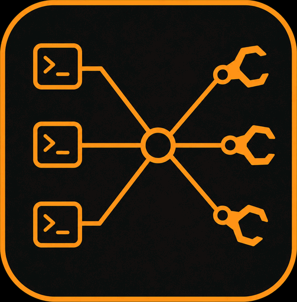

# ClankerMux 

[](https://github.com/d4rken/clankermux/actions/workflows/ci.yml)
[](https://bun.sh)
[](https://www.typescriptlang.org)
[](./LICENSE)

A multiplexing load-balancer proxy for Claude Code (and Codex/OpenAI). It fans your
requests across multiple backend accounts through one local endpoint, so you stop
hitting per-account rate limits. Point your coding client at it, add your accounts
in the dashboard, and it routes and falls back across them.

## An opinionated fork

ClankerMux began as a fork of [tombii/better-ccflare](https://github.com/tombii/better-ccflare)
(itself a fork of [snipeship/ccflare](https://github.com/snipeship/ccflare)).
After 30+ upstream PRs I decided to have my own bespoke solution.
Fast iteration and tailored to my use-case, mostly Anthropic and OpenAI accounts.
It's since diverged substantially and is developed independently, but stays
MIT-licensed and keeps the original authors' copyright intact.

Features:

* Multiplexes one endpoint across multiple Anthropic, Codex/OpenAI, and OpenAI-compatible accounts.
* Capacity-aware account selection (FEFO) — maximizes total token availability across the pool.
* Sticky session routing for high prompt-cache hit rates; survives priority edits and failover.
* Transparent 429 recovery — burst retries and failover ride out rate-limit storms
  without losing the prompt cache; single-flight probes keep parallel clients from
  stampeding an account as its cooldown expires.
* Family-scoped 529 circuit breakers — isolate the overloaded model family, admit
  one recovery probe, and briefly hold concurrent requests for transparent recovery
  before falling back to another model or provider.
* Manual control: priorities, pause/resume, force-account mode, pin an API key to an account.
* Native Responses-API passthrough for Codex CLI.
* Codex usage-reset credits — see balances and expiry, apply a reset manually, or opt
  in to automatic application before expiry or when the weekly limit is reached,
  with an audit history.
* Proxy API keys separate from dashboard access.
* Web dashboard: accounts, request history, rate-limit graphs with burn-rate
  forecasts, active-session and per-account client metrics, per-model-family weekly
  limits, analytics, spend tracking, logs.
* Optional [Caddy front proxy](deploy/caddy/README.md) holds new connections across
  app restarts while in-flight agent streams drain.
* Small dependency tree; memory-leak and stability hardening for long-running deployments.

## Related projects

* [Clankermux Usage for Cinnamon](https://github.com/d4rken/clankermux-mint-applet) — Linux Mint/Cinnamon panel applet for monitoring pooled quota usage and exhaustion forecasts.

## Build from source

Requires [Bun](https://bun.sh).

```bash
git clone https://github.com/d4rken/clankermux
cd clankermux
bun install
bun run build       # builds the dashboard (required before first run)
bun start           # serves the proxy + dashboard on http://localhost:8080
```

Add your provider accounts in the dashboard, then point your coding client at the proxy.

## Use it with Claude Code

Set `ANTHROPIC_BASE_URL` to the ClankerMux endpoint. With a logged-in Claude Pro/Team
CLI you don't need a token:

```bash
export ANTHROPIC_BASE_URL=http://localhost:8080
claude
```

If ClankerMux has API keys configured (or you aren't using Claude CLI's OAuth login),
also set a token — `dummy-key` when ClankerMux runs open, or a generated key when it's
protected:

```bash
export ANTHROPIC_BASE_URL=http://localhost:8080
export ANTHROPIC_AUTH_TOKEN=dummy-key     # or a key generated in the dashboard
claude
```

> Don't set `ANTHROPIC_AUTH_TOKEN` alongside an active Claude CLI OAuth login — Claude
> CLI warns about conflicting auth. Legacy `BETTER_CCFLARE_*` env vars and the
> `x-better-ccflare-account-id` header are still accepted.

## Use it with Codex

Add a ClankerMux model provider to `~/.codex/config.toml`:

```toml
model_provider = "clankermux"

[model_providers.clankermux]
name = "ClankerMux"
base_url = "http://localhost:8080/v1"
wire_api = "responses"
env_key = "CLANKERMUX_API_KEY"
```

Then set the proxy key and launch Codex:

```bash
export CLANKERMUX_API_KEY=dummy-key     # or a key generated in the dashboard
codex
```

`dummy-key` is sufficient when ClankerMux runs open. Codex reads the variable named
by `env_key` and sends it as a bearer token, so the secret stays out of `config.toml`.

## License

MIT — see [LICENSE](LICENSE).
