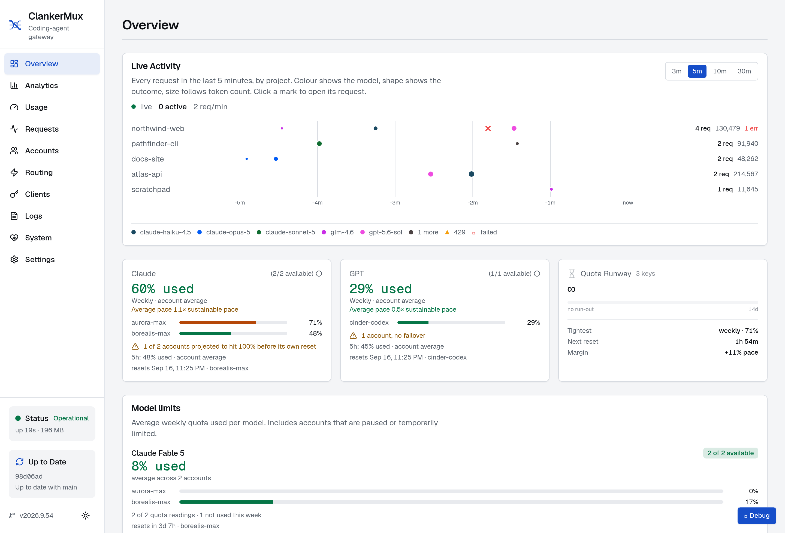
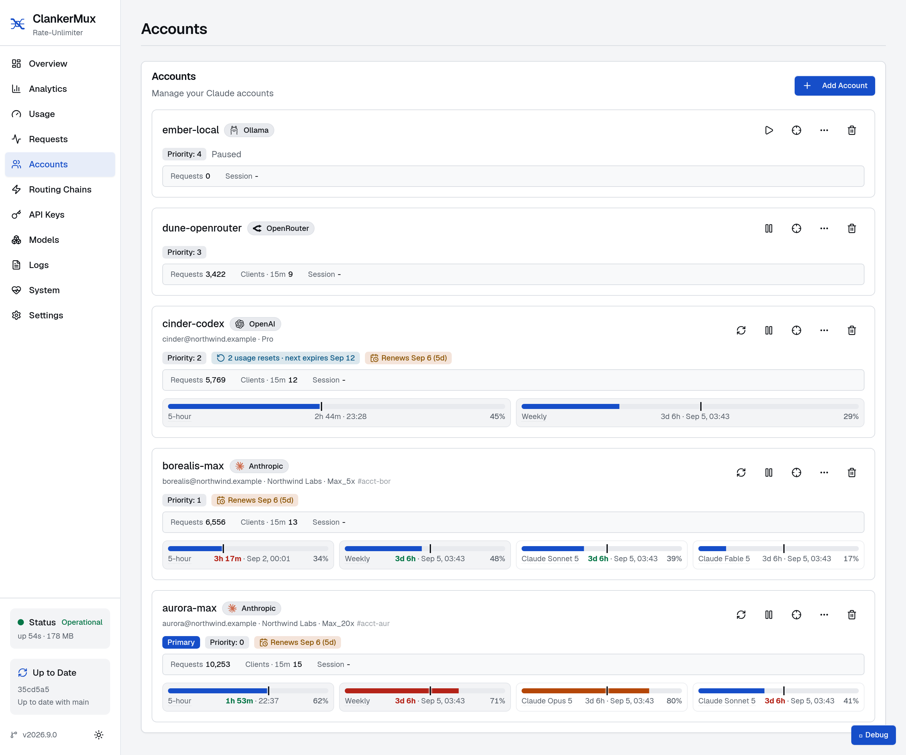
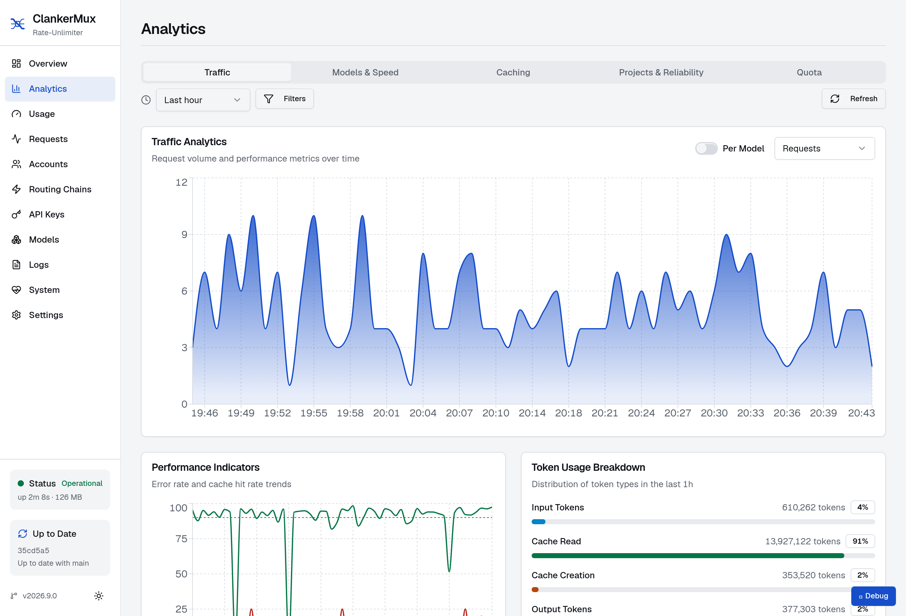

<!--
  The mark is two files rather than one with a media query: an SVG behind an
   renders in the browser's secure static mode and GitHub proxies README
  images through a sanitiser, so the theme has to be chosen outside the file.
  <picture> is the mechanism GitHub documents for that. The same applies to the
  screenshots below, which is why each one is a light/dark pair. Their links can
  only name one file, so they point at the dark variant deliberately.

  The mark comes from `bun run build:readme-media`. The screenshots come from
  `bun run build:readme-screenshots`, which boots a real ClankerMux against a
  synthetic database in a network namespace and photographs it — see
  scripts/readme-media/.
-->
# ClankerMux <picture><source media="(prefers-color-scheme: dark)" srcset="docs/media/logo-dark.svg"></picture>

[](https://github.com/d4rken/clankermux/actions/workflows/ci.yml)
[](https://bun.sh)
[](https://www.typescriptlang.org)
[](./LICENSE)

A multiplexing load-balancer proxy for Claude Code (and Codex/OpenAI). It fans your
requests across multiple backend accounts through one local endpoint, so you stop
hitting per-account rate limits. Point your coding client at it, add your accounts
in the dashboard, and it routes and falls back across them.

## An opinionated fork

ClankerMux began as a fork of [tombii/better-ccflare](https://github.com/tombii/better-ccflare)
(itself a fork of [snipeship/ccflare](https://github.com/snipeship/ccflare)). After 30+
upstream PRs I wanted something bespoke: fast iteration, tailored to my use case of
mostly Anthropic and OpenAI accounts. It has since diverged substantially and is
developed independently, but stays MIT-licensed and keeps the original authors'
copyright intact.

Features:

* Multiplexes one endpoint across multiple Anthropic, Codex/OpenAI, and OpenAI-compatible accounts.
* Capacity-aware account selection (FEFO) — maximizes total token availability across the pool.
* Sticky session routing for high prompt-cache hit rates; survives priority edits and failover.
* Transparent 429 recovery — burst retries and failover ride out rate-limit storms
  without losing the prompt cache; single-flight probes keep parallel clients from
  stampeding an account as its cooldown expires.
* Family-scoped 529 circuit breakers — isolate the overloaded model family, admit
  one recovery probe, and briefly hold concurrent requests for transparent recovery
  before falling back to another model or provider.
* Manual control: priorities, pause/resume, force-account mode, pin an API key to an account.
* Native Responses-API passthrough for Codex CLI.
* Codex usage-reset credits — see balances and expiry, apply a reset manually, or opt
  in to automatic application before expiry or when the weekly limit is reached,
  with an audit history.
* Proxy API keys separate from dashboard access.
* Web dashboard: accounts, request history, rate-limit graphs with burn-rate
  forecasts, active-session and per-account client metrics, per-model-family weekly
  limits, analytics, spend tracking, logs.
* Optional [Caddy front proxy](deploy/caddy/README.md) holds new connections across
  app restarts while in-flight agent streams drain.
* Small dependency tree; memory-leak and stability hardening for long-running deployments.

## Screenshots

<table>
<tr>
<td width="25%"><a href="docs/media/overview-dark.png"><picture><source media="(prefers-color-scheme: dark)" srcset="docs/media/overview-dark.png"></picture></a></td>
<td width="25%"><a href="docs/media/accounts-dark.png"><picture><source media="(prefers-color-scheme: dark)" srcset="docs/media/accounts-dark.png"></picture></a></td>
<td width="25%"><a href="docs/media/limits-dark.png"><picture><source media="(prefers-color-scheme: dark)" srcset="docs/media/limits-dark.png"></picture></a></td>
<td width="25%"><a href="docs/media/analytics-dark.png"><picture><source media="(prefers-color-scheme: dark)" srcset="docs/media/analytics-dark.png"></picture></a></td>
</tr>
</table>

## Related projects

* [Clankermux Usage for Cinnamon](https://github.com/d4rken/clankermux-mint-applet) — Linux Mint/Cinnamon panel applet for monitoring pooled quota usage and exhaustion forecasts.

## Build from source

Requires [Bun](https://bun.sh) 1.4.0 or newer — on older runtimes a client aborting a
streaming response segfaults the process
([oven-sh/bun#32111](https://github.com/oven-sh/bun/issues/32111)), which is routine
traffic for a proxy, so ClankerMux refuses to start. CI pins the exact version in
`.bun-version`.

```bash
git clone https://github.com/d4rken/clankermux
cd clankermux
bun install
bun run build       # builds the dashboard (required before first run)
bun start           # serves the proxy + dashboard on http://localhost:8080
```

Add your accounts in the dashboard, then point your client at a wire mount:
`/wire/anthropic` for the Anthropic Messages API, `/wire/openai` for the OpenAI
Responses API. The mount names the format the client speaks, not the account pool it is
served from. Bare `/v1/*` and `/messages/*` were removed and answer 404.

## Use it with Claude Code

Set `ANTHROPIC_BASE_URL` to the ClankerMux endpoint. With a logged-in Claude Pro/Team
CLI you don't need a token:

```bash
export ANTHROPIC_BASE_URL=http://localhost:8080/wire/anthropic
claude
```

If ClankerMux has API keys configured (or you aren't using Claude CLI's OAuth login),
also set a token — `dummy-key` when ClankerMux runs open, or a generated key when it's
protected:

```bash
export ANTHROPIC_BASE_URL=http://localhost:8080/wire/anthropic
export ANTHROPIC_AUTH_TOKEN=dummy-key     # or a key generated in the dashboard
claude
```

> Don't set `ANTHROPIC_AUTH_TOKEN` alongside an active Claude CLI OAuth login — Claude
> CLI warns about conflicting auth. Legacy `BETTER_CCFLARE_*` env vars and the
> `x-better-ccflare-account-id` header are still accepted.

## Use it with Codex

Add a ClankerMux model provider to `~/.codex/config.toml`:

```toml
model_provider = "clankermux"

[model_providers.clankermux]
name = "ClankerMux"
base_url = "http://localhost:8080/wire/openai/v1"
wire_api = "responses"
env_key = "CLANKERMUX_API_KEY"
```

Then set the proxy key and launch Codex:

```bash
export CLANKERMUX_API_KEY=dummy-key     # or a key generated in the dashboard
codex
```

`dummy-key` is sufficient when ClankerMux runs open. Codex reads the variable named
by `env_key` and sends it as a bearer token, so the secret stays out of `config.toml`.

## Curate the model list

Each mount answers `GET /v1/models` in the shape its clients parse, and the dashboard's
**Models** page decides what that list contains: over the upstream catalogue it layers
hides, renames and additions, per mount. Hiding a model for Codex leaves Claude Code's
list untouched.

OpenAI-format clients read `/wire/openai/v1/models` with no flag. Claude Code reads the
list only with gateway model discovery on:

```bash
export ANTHROPIC_BASE_URL=http://localhost:8080/wire/anthropic
export CLAUDE_CODE_ENABLE_GATEWAY_MODEL_DISCOVERY=1
claude
```

Three limits worth knowing: Claude Code's picker only shows ids naming the Claude
family, so a custom entry called anything else is served but never listed there; a
rename needs a wire shape with a name field, so for plain OpenAI clients it shows in the
dashboard only; and hiding removes a model from the list without blocking it — a client
that asks for it by name is still proxied.

## License

MIT — see [LICENSE](LICENSE).
