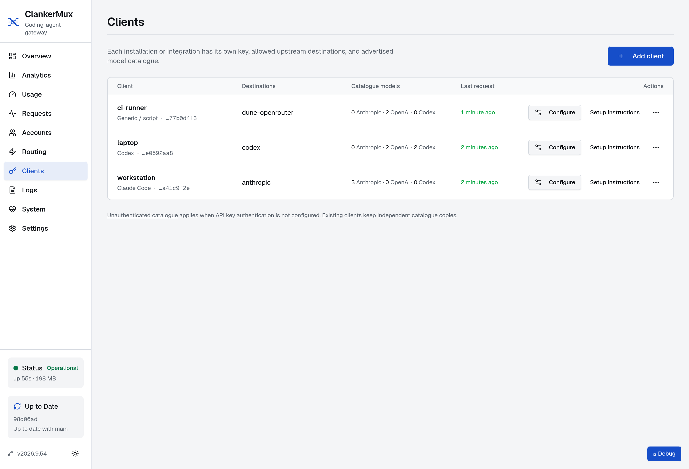
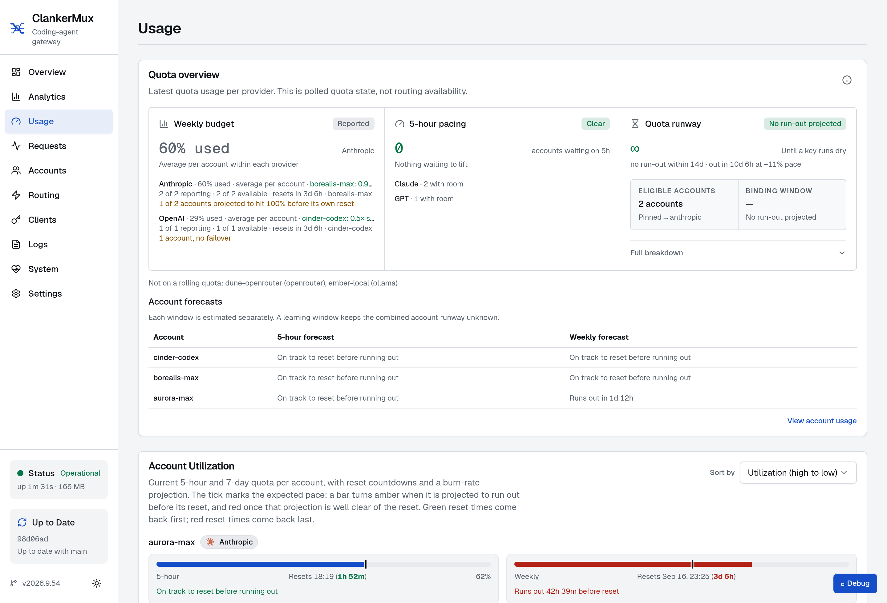

<!--
  The banner and the screenshots are two files each rather than one with a media
  query: an SVG behind an  renders in the browser's secure static mode and
  GitHub proxies README images through a sanitiser, so the theme has to be
  chosen outside the file. <picture> is the mechanism GitHub documents for that.
  The screenshot links can only name one file, so they point at the dark variant
  deliberately.

  The banner comes from `bun run build:readme-media`. The screenshots come from
  `bun run build:readme-screenshots`, which boots a real ClankerMux against a
  synthetic database in a network namespace and photographs it, see
  scripts/readme-media/.
-->
<h1><picture><source media="(prefers-color-scheme: dark)" srcset=".assets/banner-dark.svg"></picture></h1>

[](https://github.com/d4rken/clankermux/actions/workflows/ci.yml)
[](https://bun.sh)
[](https://www.typescriptlang.org)
[](./LICENSE)

A proxy for the model accounts you already pay for. Point your coding clients at
one endpoint; ClankerMux spreads requests across the accounts, decides per
client what each can reach, and shows you how much quota is left.

## Highlights

* **Harnesses**: Claude Code, Codex, OpenCode, Pi Agent, Oh My Pi. Two
  endpoints: `/wire/anthropic` for the Messages API, `/wire/openai` for
  Responses and Chat Completions.
* **Providers**: Anthropic and Codex OAuth logins, Claude and OpenAI API keys,
  OpenRouter, Ollama, and other compatible endpoints. Experimental ones are
  marked in the dashboard.
* Priority-based account selection, preferring earlier weekly resets among
  accounts with capacity at the same priority.
* Sticky session routing for prompt-cache hit rates, surviving priority edits
  and failover.
* Cross-account failover on any provider, 429 burst retries for Anthropic OAuth
  accounts, and family-scoped 529 breakers for official Anthropic accounts.
* Reusable model aliases, such as `good-model` or `fast-model`, with ordered
  fallback targets. Manage aliases on the Routing tab, then publish them in each
  client's model editor for discovery. Eligible accounts for one target are
  exhausted before trying the next model on quota or temporary availability
  failures; client destination restrictions still apply. Concrete model IDs keep
  their selected model, and streaming output is never restarted on a fallback.
* Pooled 5-hour and 7-day quota with burn-rate forecasts and a runway estimate
  against each window's reset.
* Statistics and analytics filterable by account and by client, so a problem can
  be pinned to one provider or one harness: request history by status code,
  per-model latency and token speed, cache effectiveness, tool-call error rates,
  and the routing attempts behind an individual request.

## Screenshots

<table>
<tr>
<td width="25%"><a href=".assets/overview-dark.png"><picture><source media="(prefers-color-scheme: dark)" srcset=".assets/overview-dark.png"></picture></a></td>
<td width="25%"><a href=".assets/clients-dark.png"><picture><source media="(prefers-color-scheme: dark)" srcset=".assets/clients-dark.png"></picture></a></td>
<td width="25%"><a href=".assets/limits-dark.png"><picture><source media="(prefers-color-scheme: dark)" srcset=".assets/limits-dark.png"></picture></a></td>
<td width="25%"><a href=".assets/routing-dark.png"><picture><source media="(prefers-color-scheme: dark)" srcset=".assets/routing-dark.png"></picture></a></td>
</tr>
</table>

## Install and run

```bash
git clone https://github.com/d4rken/clankermux
cd clankermux
bun install
bun run build       # builds the dashboard (required before first run)
bun start           # serves the proxy + dashboard on http://localhost:8080
```

Requires [Bun](https://bun.sh) 1.4.0 or newer
([why](https://github.com/oven-sh/bun/issues/32111)).

It binds `0.0.0.0` by default; set `CLANKERMUX_HOST=127.0.0.1` for loopback
only. The management API is fail-open until a dashboard password exists, so set
one with `bun run auth:password --set`. That password covers management only.
Agent traffic is gated separately: every request must present a valid client
key, including on a fresh install where none exists yet.

Then add an account, open **Clients**, and add a client. Clients speak either
wire format: `/wire/anthropic` for the Anthropic Messages API, `/wire/openai`
for the OpenAI Responses and Chat Completions APIs.

In the client's **Allowed destinations** step, choose all providers, only selected
providers, all except selected providers, or one account. For example, excluding
`anthropic` blocks Anthropic OAuth while allowing other providers, including ones
you add later. Claude API-key accounts (`claude-console-api`) are a separate
provider. These restrictions also apply to explicit account requests and fallbacks.

## Integrations

* Model metadata discovery: client keys can add `?clankermux_metadata=1` to
  either wire's `/v1/models` to get context/output limits, modalities, pricing
  and cache policy alongside the native list. See
  [cache-policy coverage and client semantics](docs/public-api/cache-policy.md).
* [Public widget API](docs/public-api/README.md) for external displays and
  applets, with JSON Schemas and example payloads.
* [Clankermux Usage for Cinnamon](https://github.com/d4rken/clankermux-mint-applet),
  a Linux Mint panel applet for pooled quota and exhaustion forecasts.
* [Clankermux Usage for macOS](https://github.com/d4rken/clankermux-macos-applet),
  the same for the macOS menu bar.

## Running it persistently

* [systemd unit and drop-ins](deploy/systemd/README.md) for running it as a
  service. They mirror one host's install, so the user, paths and ports in them
  need editing before they fit yours.
* [Caddy front proxy](deploy/caddy/README.md), which holds new connections across
  app restarts while in-flight agent streams drain.

## Project notes

ClankerMux began as a fork of [tombii/better-ccflare](https://github.com/tombii/better-ccflare),
itself a fork of [snipeship/ccflare](https://github.com/snipeship/ccflare). After
dozens of upstream PRs I decided to take it in a different direction, and it has
been developed independently since.

## License

AGPLv3. See [LICENSE](LICENSE), full text in [COPYING](COPYING). If you modify
ClankerMux and let other people reach it over a network, section 13 obliges you
to offer them the source of your modified version.

The inherited upstream code, and everything previously published under MIT, stay
MIT ([LICENSE.MIT](LICENSE.MIT)); the bundled Devin protocol code and the Geist
fonts keep their own terms.
