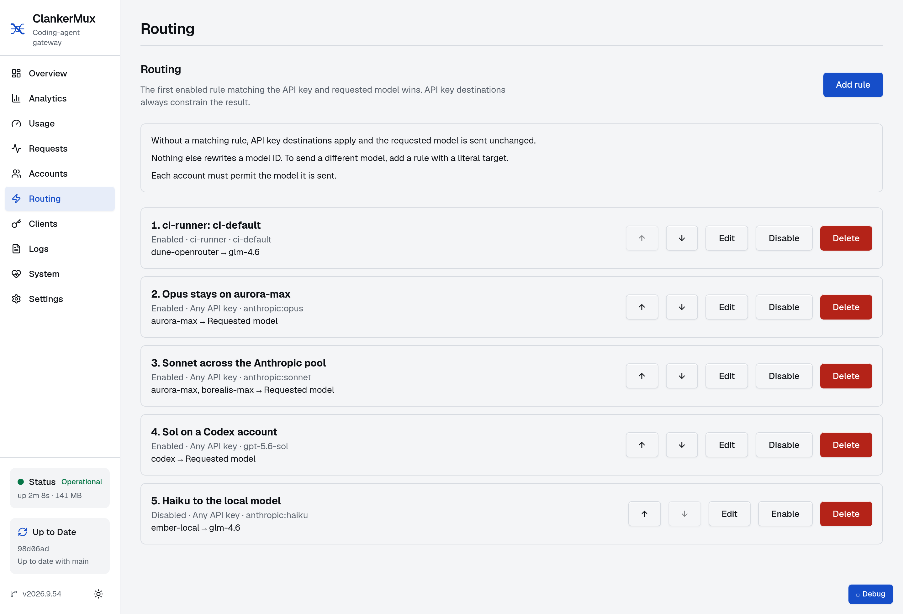

<!--
  The mark is two files rather than one with a media query: an SVG behind an
   renders in the browser's secure static mode and GitHub proxies README
  images through a sanitiser, so the theme has to be chosen outside the file.
  <picture> is the mechanism GitHub documents for that. The same applies to the
  screenshots below, which is why each one is a light/dark pair. Their links can
  only name one file, so they point at the dark variant deliberately.

  The mark comes from `bun run build:readme-media`. The screenshots come from
  `bun run build:readme-screenshots`, which boots a real ClankerMux against a
  synthetic database in a network namespace and photographs it — see
  scripts/readme-media/.
-->
# <picture><source media="(prefers-color-scheme: dark)" srcset="docs/media/logo-dark.svg"></picture> ClankerMux

[](https://github.com/d4rken/clankermux/actions/workflows/ci.yml)
[](https://bun.sh)
[](https://www.typescriptlang.org)
[](./LICENSE)

**A self-hosted gateway for coding agents.**

## What it is

ClankerMux sits between your coding clients and the accounts that serve them. It
fans requests across your configured, eligible accounts through one front door,
decides per client which upstream accounts and which models are reachable, and
forecasts how much quota is left before each window resets. It does not run
agents, and it cannot invent capacity: when every eligible account is exhausted,
requests stop.

## What you can do

### Connect and configure

* Add accounts from 14 provider types, from Anthropic and Codex OAuth logins
  through API-key gateways to a local Ollama.
* Give each installation its own client: its own key, its own allowed upstream
  destinations, and its own advertised model catalogue. The dashboard generates
  that client's configuration for you.
* Keep dashboard access and proxy keys as separate credentials.
* Write routing rules that decide which accounts serve which models, per client.

### Route and recover

* Capacity-aware account selection. Priority decides first; within a priority,
  the account whose weekly window resets soonest goes first, because that is
  where unused budget is lost (FEFO).
* Sticky session routing for high prompt-cache hit rates. It survives priority
  edits and failover.
* Cross-account failover, the recovery path that works on every provider: a
  request an account cannot serve moves to the next eligible one.
* Transparent 429 burst retries on Anthropic OAuth accounts, so a rate-limit
  storm does not cost you the prompt cache. Single-flight probes stop parallel
  clients stampeding an account as its cooldown expires.
* Family-scoped 529 circuit breakers on official Anthropic accounts. They
  isolate the overloaded model family, admit one recovery probe, and briefly
  hold concurrent requests before falling back to another model or provider.
* Manual control: priorities, pause and resume, and forcing a single account
  with the `x-clankermux-account-id` header.

### Understand capacity

* Pooled 5-hour and 7-day quota with burn-rate forecasts, per-model-family
  weekly limits, and a runway estimate against each window's reset.
* Request history, active sessions, per-account and per-client metrics,
  analytics, spend tracking and logs.
* Codex usage-reset credits: balances and expiry, applied by hand or
  automatically before they expire or when the weekly limit is reached, with an
  audit history.

## Compatibility

### Clients

Six applications get generated setup instructions: Claude Code, Codex, OpenCode,
Pi Agent, Oh My Pi, and a generic preset for scripts and anything
OpenAI-compatible. Each one is emitted as a tab per place the configuration
belongs: the file it is merged into, the shell environment it needs, and where
the client has one, the launch command.

### Upstream providers

Validated with a live account: Claude CLI OAuth, Claude API, Codex (OpenAI
OAuth), Devin, OpenRouter.

The rest are offered with the dashboard's own warning, that the integration has
not been validated with a live account and that authentication, usage tracking
and recovery may have issues: Qwen (Alibaba Cloud OAuth), z.ai, Minimax,
Anthropic-compatible, OpenAI-compatible, Kilo Gateway, Alibaba Coding Plan
International, Ollama (v0.14.0+, local), Ollama Cloud.

### Protocols

Point your client at a wire mount: `/wire/anthropic` for the Anthropic Messages
API, `/wire/openai` for the OpenAI Responses and Chat Completions APIs. The mount
names the format the client speaks, not the account pool it is served from. Bare
`/v1/*` and `/messages/*` were removed and answer 404.

Chat clients use `POST /wire/openai/v1/chat/completions` with the usual bearer
client key. Destinations are Codex and OpenRouter, inside the key's existing
restrictions and model permissions. Text, function tools, tool history, JSON
responses and streaming are supported. Explicit output caps, sampling controls
and `stop` require OpenRouter; Codex requests must omit them. Unsupported fields
return 400. Legacy `/v1/completions` remains unsupported. See the
[Chat support matrix and client test evidence](docs/chat-completions-implementation-plan.md)
for the isolated OpenCode profile and current limits.

## Screenshots

<table>
<tr>
<td width="25%"><a href="docs/media/overview-dark.png"><picture><source media="(prefers-color-scheme: dark)" srcset="docs/media/overview-dark.png"></picture></a></td>
<td width="25%"><a href="docs/media/clients-dark.png"><picture><source media="(prefers-color-scheme: dark)" srcset="docs/media/clients-dark.png"></picture></a></td>
<td width="25%"><a href="docs/media/limits-dark.png"><picture><source media="(prefers-color-scheme: dark)" srcset="docs/media/limits-dark.png"></picture></a></td>
<td width="25%"><a href="docs/media/routing-dark.png"><picture><source media="(prefers-color-scheme: dark)" srcset="docs/media/routing-dark.png"></picture></a></td>
</tr>
</table>

## Install and run

```bash
git clone https://github.com/d4rken/clankermux
cd clankermux
bun install
bun run build       # builds the dashboard (required before first run)
bun start           # serves the proxy + dashboard on http://localhost:8080
```

Requires [Bun](https://bun.sh) 1.4.0 or newer, and refuses to start on anything
older. (On older runtimes a client aborting a streaming response segfaults the
process, [oven-sh/bun#32111](https://github.com/oven-sh/bun/issues/32111), which
is routine traffic for a proxy. CI pins the exact version in `.bun-version`.)

Two things to settle before you leave it running. The server binds `0.0.0.0` by
default, so set `CLANKERMUX_HOST=127.0.0.1` if you want it on loopback only. And
the management API under `/api/*` is fail-open until a dashboard password
exists, so anyone who can reach the port can manage accounts, issue keys and
read request logs. Set one with `bun run auth:password --set`.

## Connect your first client

Add an account on the Accounts page, then open **Clients** and press **Add
client**. The wizard steps through Application, Destinations, Catalogue and
Review, and finishes by showing the client's key and its generated
configuration, on a tab per file the configuration belongs in. Copy it into the
client. Both stay available afterwards from Setup instructions on the Clients
page.

For Claude Code that comes out as a shell environment:

```bash
export ANTHROPIC_BASE_URL=http://localhost:8080/wire/anthropic
export ANTHROPIC_AUTH_TOKEN=<the client key>
export CLAUDE_CODE_ENABLE_GATEWAY_MODEL_DISCOVERY=1
claude
```

Wire authentication is enforced while at least one client key is active, and the
check runs per request: disable or delete the last active client and the gateway
serves keyless again, from the unauthenticated catalogue. While any client key
is active Claude Code must send a valid client key, so a CLI that is also logged
in with OAuth shows its conflicting-auth warning.

Legacy `BETTER_CCFLARE_*` env vars and the `x-better-ccflare-account-id` header
are still accepted.

## Model access

Three separate controls decide what a request may reach.

* A client's **catalogue** decides what that client's `GET /v1/models`
  advertises, per wire format. This is discovery only: a model you leave out is
  not blocked, and a client that asks for it by name is still routed under the
  normal policy.
* **Routing rules** decide which accounts may serve a request, and a rule with a
  literal target is the only thing that may rewrite a model id. With no matching
  rule the client's destinations apply and the requested model is sent
  unchanged.
* An account's **Permitted models** authorize the resolved target. Discovered
  models plus any manual additions. While an account's discovery state is still
  unknown, a rule naming that account with a literal target authorizes that pair
  on its own; the exception stops applying once the list is known-complete or
  known-empty.

An alias in a catalogue, an entry whose id points at a different upstream model,
creates a literal routing rule scoped to that client's key and restricted to the
upstream accounts you picked for it. It takes precedence for that client and
that model id. Hiding the entry afterwards keeps the rule.

A Codex-format catalogue entry needs saved Codex metadata from an eligible
account, so that list is built from what your configured accounts can actually
describe.

OpenAI-format clients read `/wire/openai/v1/models` with no flag. Claude Code
reads the list only with `CLAUDE_CODE_ENABLE_GATEWAY_MODEL_DISCOVERY=1` set.
Two limits worth knowing there: its picker only shows ids naming the Claude
family, so an entry called anything else is served but never listed; and a
rename needs a wire shape with a name field, so for plain OpenAI clients the
display name shows in the dashboard only.

## Integrations

* [Public widget API](docs/public-api/README.md) for external displays and
  applets, with JSON Schemas, example payloads and quota-guidance integration
  instructions.
* [Clankermux Usage for Cinnamon](https://github.com/d4rken/clankermux-mint-applet),
  a Linux Mint/Cinnamon panel applet for pooled quota usage and exhaustion
  forecasts.

## Running it persistently

* [systemd unit](deploy/systemd/README.md) for running it as a service.
* [Caddy front proxy](deploy/caddy/README.md), which holds new connections across
  app restarts while in-flight agent streams drain.

## Project notes

ClankerMux began as a fork of [tombii/better-ccflare](https://github.com/tombii/better-ccflare)
(itself a fork of [snipeship/ccflare](https://github.com/snipeship/ccflare)). After 30+
upstream PRs I wanted something bespoke: fast iteration, tailored to my use case of
mostly Anthropic and OpenAI accounts. It has since diverged substantially and is
developed independently, but stays MIT-licensed and keeps the original authors'
copyright intact.

## License

MIT. See [LICENSE](LICENSE).
